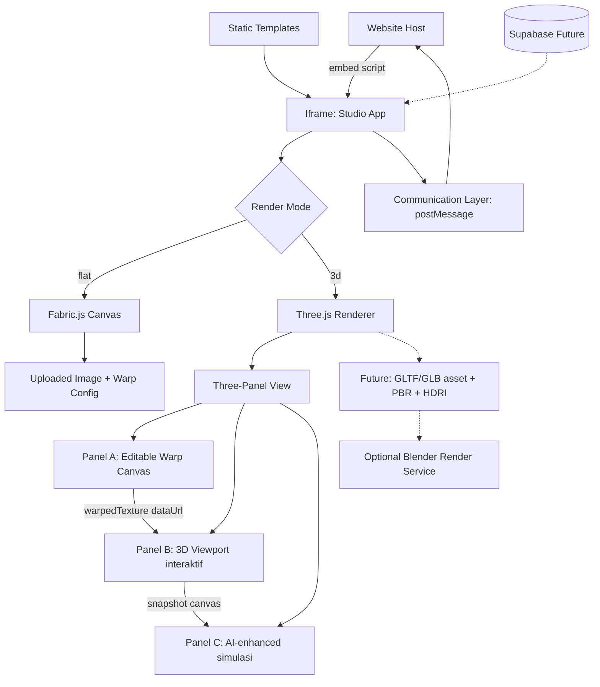

# Desain Arsitektur & Antarmuka

## System Overview



## Architecture Principles

- MVP mengaktifkan flat editor terlebih dahulu.
- 3D viewport sudah diimplementasi (Active Scope) — dipisah dengan lazy loading dan tidak masuk initial bundle.
- Three-panel view (Panel A warp → Panel B 3D → Panel C render) diterapkan untuk mode `3d`.
- Product template mengikuti `specs/product-schema.md`.
- Event komunikasi mengikuti `specs/events.md`.
- State global memakai Zustand.
- Preview rendering berjalan client-side.
- Server rendering tidak digunakan.
- Panel C (AI-enhanced) adalah simulasi canvas 2D — bukan AI generatif sungguhan (lihat `specs/rendering-roadmap.md` Level 5-6).

## Application Modules

### Studio App

React SPA yang dapat berjalan sebagai aplikasi penuh atau halaman embed.

Responsibilities:

- Membaca product id dari URL/query.
- Memuat product template.
- Memilih editor berdasarkan `product.mode`.
- Mengelola state global.
- Mengirim event ke host.

### Embed Script

Vanilla JS bundle kecil yang dipasang di website host.

Responsibilities:

- Membaca atribut `data-product`, `data-lang`, `data-width`, `data-height`, dan `data-container`.
- Membuat iframe.
- Menyusun URL iframe.
- Tidak membawa dependency React, Fabric.js, atau Three.js.
- Menjaga ukuran bundle kurang dari 5 KB gzip.

### Embed Page

Halaman React (`src/components/EmbedPage.tsx`) yang dirender oleh Studio App pada route `/embed`, **berjalan di dalam iframe** yang dibuat oleh Embed Script. Ini adalah modul yang terpisah dari `embed.js`: `embed.js` hidup di halaman host dan tugasnya membuat iframe, sedangkan `EmbedPage` hidup di dalam iframe dan menjadi entry point Studio App untuk konteks embed.

Responsibilities:

- Menghapus chrome aplikasi (header/navigasi) yang tidak relevan saat berjalan dalam iframe.
- Menginisialisasi Communication Layer saat mount.
- Mengirim `studio-ready` setelah siap menerima command host.
- Merender `StudioApp` dengan layout yang sesuai untuk konteks embed.

### Flat Editor

Editor MVP berbasis Fabric.js.

Responsibilities:

- Render background image produk.
- Render uploaded image di canvas.
- Menampilkan 4 warp control points yang dapat di-drag.
- Mengelola drag, scale, rotate, dan reset.
- Capture canvas sebagai PNG via `canvas.toDataURL()`.
- Menyediakan jalur akses warp control point di luar canvas murni (mis. elemen overlay dengan `data-testid` per titik) agar dapat ditarget Playwright untuk E2E.

### 3D Product Viewer

Komponen `src/features/3d/Product3DViewer.tsx` — lazy-loaded, tidak masuk initial bundle MVP.

Responsibilities:

- Menampilkan **three-panel view** berdampingan:
  - **Panel A — Editable Warp Canvas**: canvas 2D tunggal untuk render dan interaksi sekaligus. Pengguna menggeser 4 titik sudut untuk memetakan posisi desain. Pada `pointerup`, hasil warp di-capture sebagai data URL dan dikirim ke Panel B sebagai tekstur. Warp points disimpan sebagai `ref` (bukan `useState`) agar drag tidak memicu re-render React.
  - **Panel B — Viewport 3D interaktif**: Three.js canvas dengan auto-rotate, drag untuk kontrol manual, shape switcher. Tekstur diload via `THREE.TextureLoader` dari data URL hasil Panel A. Menggunakan `preserveDrawingBuffer: true` agar Panel C dapat snapshot frame-nya. Tekstur lama di-dispose untuk mencegah memory leak.
  - **Panel C — AI-enhanced render (simulasi)**: snapshot dari WebGL canvas Panel B, diperbarui setiap 80ms. Efek canvas 2D: shadow, highlight, warm tone, vignette, color grading CSS filter. Label wajib "AI-enhanced mockup (simulasi)" — bukan AI generatif sungguhan (lihat `specs/rendering-roadmap.md` Level 6).
- Kontrol texture (scale, offset X, offset Y) via slider reaktif `useState`.
- Shape switcher: Silinder (`CylinderGeometry`), Kotak (`BoxGeometry`), Cincin (`TorusGeometry`), Bola (`SphereGeometry`).

### Texture Pipeline (Upload → Warp → 3D)

Alur data tekstur dari input pengguna ke tampilan 3D:

1. Pengguna upload gambar → disimpan sebagai data URL di Zustand (`uploadedImage`).
2. Panel A load gambar ke `HTMLImageElement`, menggambar ke canvas 2D dengan `warpImageToQuad()`.
3. Pada `pointerup`, Panel A emit `canvas.toDataURL()` → `warpedTex` state diperbarui.
4. `ShapeMesh` terima `textureUrl = warpedTex ?? uploadedImage ?? BLANK_URL` → `THREE.TextureLoader.load()`.
5. Panel C snapshot `gl.domElement` setiap 80ms dan terapkan efek canvas 2D.

### Communication Layer

Wrapper untuk `postMessage`.

Responsibilities:

- Validasi origin.
- Validasi event type.
- Encode/decode message envelope.
- Menyediakan API internal `sendToHost` dan `handleHostCommand`.

## State Management

State global wajib memakai Zustand.

```ts
type StudioState = {
  currentProduct: Product | null;
  uploadedImage: string | null;
  warpConfiguration: {
    points: [WarpPoint, WarpPoint, WarpPoint, WarpPoint];
    imageX: number;
    imageY: number;
    imageScale: number;
    imageRotation: number;
  } | null;
  previewStatus: "idle" | "dirty" | "capturing" | "ready" | "error";
};
```

State responsibilities:

- `currentProduct`: produk aktif yang sedang diedit.
- `uploadedImage`: image source dari upload pengguna.
- `warpConfiguration`: posisi warp dan transform image.
- `previewStatus`: status capture atau preview, termasuk `"error"` saat product config gagal dimuat (lihat Error Flow).

## Data Flow

### Mode Flat

1. Website host memuat `embed.js`.
2. `embed.js` membuat iframe menuju `/embed?product=<id>`.
3. `EmbedPage` mount di dalam iframe dan menginisialisasi Communication Layer.
4. Studio membaca query `product`.
5. Studio memuat `public/templates/<product>/config.json`.
6. Studio menyimpan product ke Zustand.
7. Studio merender `FlatEditor` untuk mode `flat`.
8. Pengguna upload image.
9. Image diterapkan ke canvas dengan corner-pin warp.
10. Setiap perubahan memperbarui state dan canvas.
11. Saat save, studio melakukan capture PNG.
12. Studio mengirim `design-saved` ke host.

### Mode 3D

1–6. Sama dengan mode flat.
7. Studio merender `Product3DViewer` (lazy-loaded) untuk mode `3d`.
8. `Product3DViewer` menampilkan three-panel view (Panel A / B / C).
9. Pengguna upload image → masuk `uploadedImage` Zustand.
10. Panel A memuat gambar → menggambar dengan `warpImageToQuad()`.
11. Pengguna menggeser 4 titik sudut di Panel A → canvas diupdate real-time.
12. Pada `pointerup` → Panel A emit `canvas.toDataURL()` → `warpedTex` state.
13. Panel B menerima `warpedTex` → `THREE.TextureLoader.load()` → ditempel ke shape aktif.
14. Panel C snapshot WebGL canvas Panel B setiap 80ms → efek canvas 2D → tampil sebagai preview render.

### Error Flow

- Jika `public/templates/<product>/config.json` gagal dimuat atau tidak valid terhadap `specs/product-schema.md`, studio mengubah `previewStatus` menjadi `"error"`.
- Studio mengirim event `studio-error` ke host dengan payload berikut (sesuai kontrak di `specs/events.md`):

  ```ts
  {
    type: "studio-error",
    payload: {
      code: string;
      message: string;
    }
  }
  ```

- UI menampilkan status area error (lihat checklist "Error state tampil saat product config gagal dimuat" di `specs/testing.md`).
- Error tidak menghentikan listener `postMessage`; host tetap dapat mengirim `set-product` untuk mencoba produk lain tanpa perlu reload iframe.

## Warp Engine

Keputusan teknis warp engine didokumentasikan di `docs/adr/ADR-001-warp-engine.md`.

Ringkasan:

- Gunakan Fabric.js sebagai canvas interaction layer.
- Gunakan custom perspective transform untuk corner-pin warp.
- Jangan gunakan server rendering.
- Jangan memasukkan WebGL/Three.js ke MVP untuk kebutuhan flat warp.
- Fallback hanya jika diperlukan: bila performa atau kualitas warp pada Fabric.js terbukti tidak memadai, opsi fallback adalah PixiJS atau WebGL shader untuk **area warp saja** — bukan mengganti seluruh canvas interaction layer, dan bukan pilihan default MVP.

## Photorealistic Rendering Pipeline

Roadmap rendering realistis didokumentasikan di `specs/rendering-roadmap.md`.

Prinsip desain:

- MVP menghasilkan interactive preview, bukan photorealistic render.
- Realisme ditingkatkan bertahap setelah asset 3D dan product configuration stabil.
- Browser renderer tetap dipakai untuk preview cepat.
- Blender/server render hanya dipakai untuk output kualitas tinggi atau async export.
- AI enhancement diperlakukan sebagai optional layer, bukan dependency inti.

## UI Layout

### Header & Navigation (semua mode)

- Header: nama app, badge level aktif, info product id dan mode.
- Product switcher: tombol per produk yang tersedia (`wallet-01`, `mug-01`, dll.) — klik langsung ganti produk dan update URL tanpa reload.
- Global toolbar: tombol "Upload desain" (berlaku untuk flat dan 3D), tombol Reset, indikator desain diunggah.

### Mode Flat — Flat Editor

- Mini toolbar: zoom in/out, Reset warp, Save.
- Canvas workspace (Fabric.js): area editing dengan background produk dan 4 warp control points biru.
- Status area: pesan error atau status preview.

### Mode 3D — Three-Panel View

- Shape switcher: 4 tombol (🫙 Silinder, 📦 Kotak, 💍 Cincin, 🔵 Bola).
- Tiga panel berdampingan (responsive — stack vertikal di mobile):
  - **Panel A — Hasil warp**: canvas 2D interaktif dengan 4 titik sudut yang dapat digeser.
  - **Panel B — Viewport 3D**: Three.js canvas, auto-rotate, drag untuk kontrol manual.
  - **Panel C — Hasil render**: snapshot real-time dengan efek shadow, highlight, vignette, badge "AI-enhanced mockup (simulasi)".
- Controls bar: slider Texture scale, Offset X, Offset Y.

UI harus responsif dan dapat dipakai dengan mouse maupun touch.

## Metadata

- Last updated: 2026-06-26
- Version: 1.3.0
